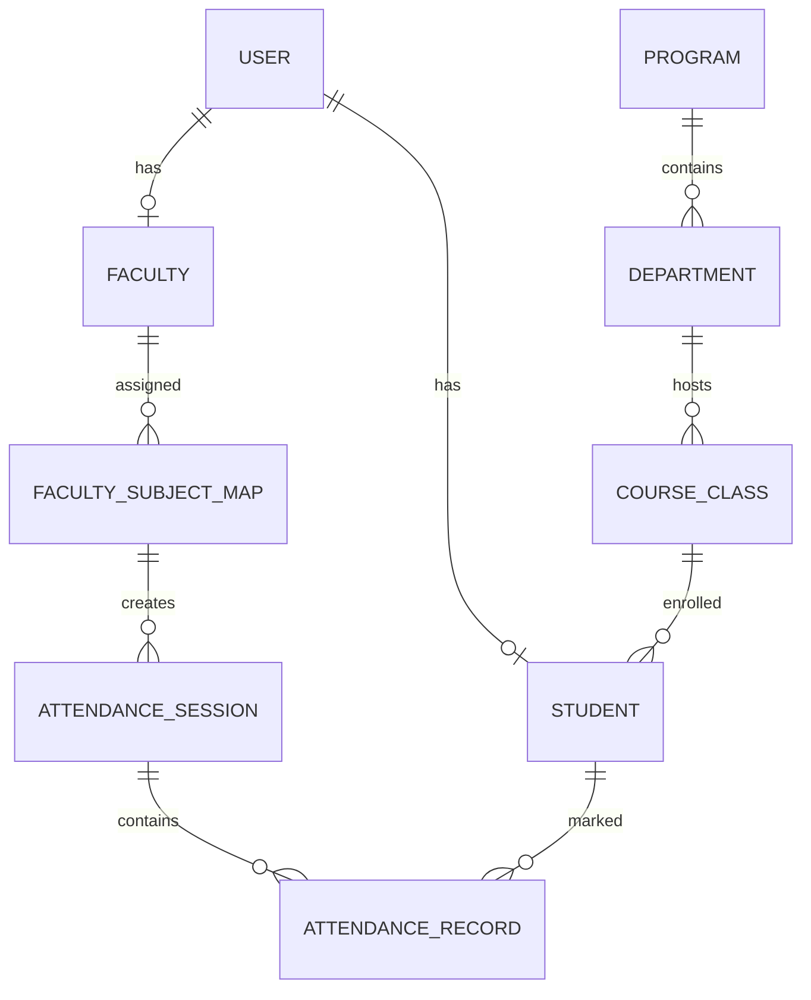

# AttendX - Smart Attendance Management System


AttendX is a state-of-the-art attendance management system designed for educational institutions like JNTUA. It leverages modern web technologies to provide a seamless, secure, and transparent attendance tracking experience for students, faculty, and administrators.

---

## 🚀 Key Features

### 📍 Smart Geo-Fencing & QR Sessions
*   **Location Verification**: Attendance can only be marked if the student is within a specific radius (e.g., 50m) of the faculty.
*   **Dynamic QR Codes**: Sessions generate encrypted, time-limited QR codes that refresh periodically to prevent spoofing.
*   **Multi-Hour Sessions**: Faculty can start attendance for continuous classes (up to 3 hours), with automatic weightage in analytics.

### 📊 Advanced Dashboards
*   **Admin Dashboard**: Full control over academic hierarchy (Programs, Departments, Classes, Subjects).
*   **Faculty Dashboard**: Session management, real-time attendance tracking, and manual overrides.
*   **Student Dashboard**: Attendance progress, smart insights, and academic alerts.
*   **HOD & Principal**: High-level departmental and college-wide analytics.
*   **CRC (Class Rep Coordinator)**: Specialized view for managing class-level attendance and at-risk students.

### ⚡ Technical Excellence
*   **Real-time Updates**: Live student counting during active sessions.
*   **Bulk Data Management**: Excel-based bulk upload for students, faculty, and historical attendance.
*   **Intelligent Alerts**: Automated "Low Attendance" warnings and missed session notifications.

---

## 🛠️ Technology Stack

### Backend (Spring Boot)
*   **Framework**: Spring Boot 3.2.0 (Java 17)
*   **Security**: Spring Security with JWT (Stateless Authentication)
*   **Persistence**: Spring Data JPA with MySQL
*   **Validation**: Jakarta Bean Validation
*   **Utilities**: Apache POI (Excel processing), Lombok

### Frontend (React)
*   **Build Tool**: Vite
*   **UI Library**: Material UI (MUI) v7 with custom premium themes
*   **Animations**: Framer Motion
*   **Charts**: Recharts
*   **State Management**: React Hooks (useState, useEffect, useMemo)
*   **Routing**: React Router DOM v7

---

## 📂 Database Architecture

The system uses a highly normalized relational schema designed for scalability and data integrity.

### Core Tables & Working

| Table Name | Description | Key Columns |
| :--- | :--- | :--- |
| `users` | Base identity table for all roles. | `username`, `password`, `role`, `email` |
| `students` | Student profiles linked to users. | `roll_no`, `section`, `admission_year` |
| `faculty` | Faculty profiles linked to users. | `faculty_id`, `designation`, `department_id` |
| `attendance_session` | Active or past attendance sessions. | `period`, `number_of_hours`, `qr_token`, `geo_coords` |
| `attendance_record` | Individual student attendance marks. | `student_id`, `session_id`, `status` (PRESENT/ABSENT) |
| `faculty_subject_map` | Mapping faculty to regular classes. | `faculty_id`, `subject_id`, `class_id`, `section` |
| `lab_faculty_assignment`| Mapping faculty to lab sessions. | `lab_subject_id`, `faculty_id`, `class_id` |
| `student_alerts` | Persistent notifications for students. | `alert_key`, `message`, `is_read` |

### Relationships (Mermaid)



---

## 🛠️ Development Insights

### Backend Workflow
1.  **Security**: Every request is intercepted by `JwtAuthenticationFilter`. Role-based access is enforced at the controller level using `@PreAuthorize`.
2.  **Attendance Logic**:
    *   `createSession`: Validates that no other session overlaps with the requested periods for that class.
    *   `endSession`: Automatically marks students as `ABSENT` if they didn't scan the QR code during the active window.
3.  **Analytics**: The `AttendanceService` calculates percentages by weighting sessions with `numberOfHours` (e.g., a 3-hour lab counts as 3 sessions).

### Frontend Workflow
1.  **Premium UI**: Uses a custom theme provider with sleek gradients, glassmorphism, and responsive layouts.
2.  **Dashboard Components**: Heavy use of `useMemo` for filtering large student lists and `useEffect` for real-time timer sync.
3.  **QR Scanning**: Integrates `html5-qrcode` with GPS validation to ensure students are physically present.

---

## ⚙️ Setup & Installation

### Prerequisites
*   Java 17 (JDK)
*   Node.js (v18+)
*   MySQL Server (v8+)
*   Maven

### 1. Database Setup
```sql
CREATE DATABASE smart_attendance;
```
Configure `backend/src/main/resources/application.properties` with your MySQL credentials.

### 2. Backend Execution
```bash
cd backend
mvn spring-boot:run
```

### 3. Frontend Execution
```bash
cd frontend
npm install
npm run dev
```

---

## 📝 Usage for Developers
*   **Default Credentials**: See [CREDENTIALS.md](./CREDENTIALS.md) for a list of pre-seeded accounts and password patterns.
*   **Adding Roles**: Update `Role.java` enum and configure security filters in `SecurityConfig.java`.
*   **New Dashboard**: Create a new page in `src/pages` and add a route in `App.jsx`.
*   **Excel Templates**: Standard templates for bulk upload are located in the root directory.

---
*Developed with ❤️ for Advanced Agentic Coding.*
